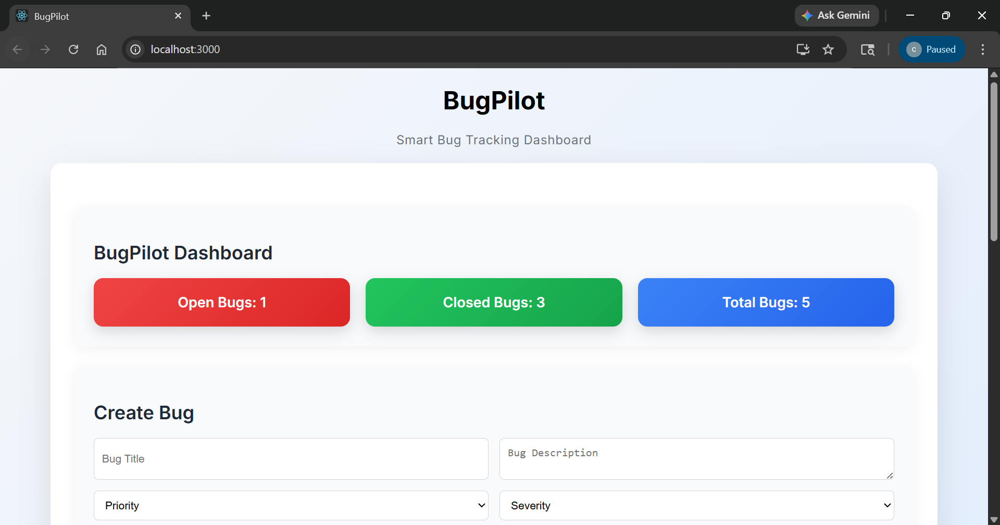
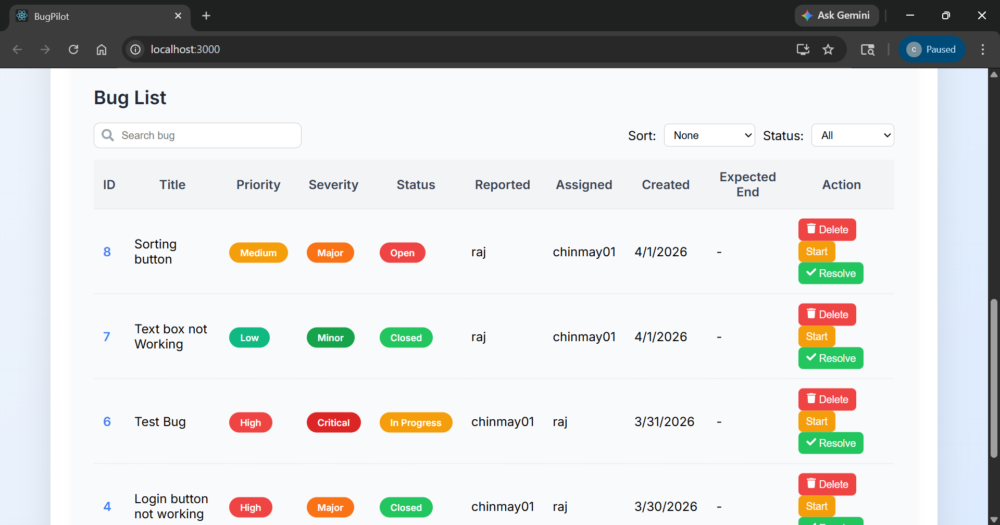
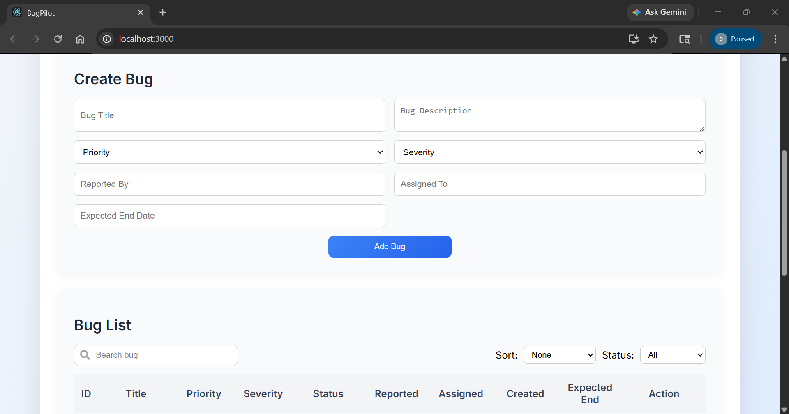
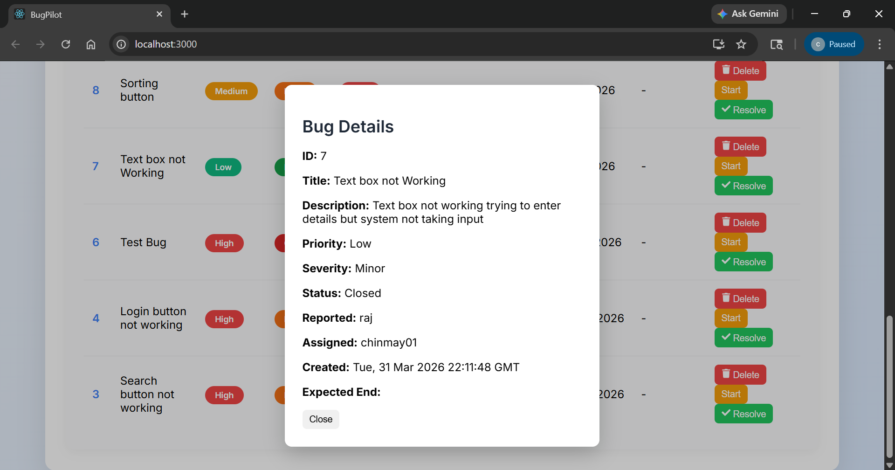
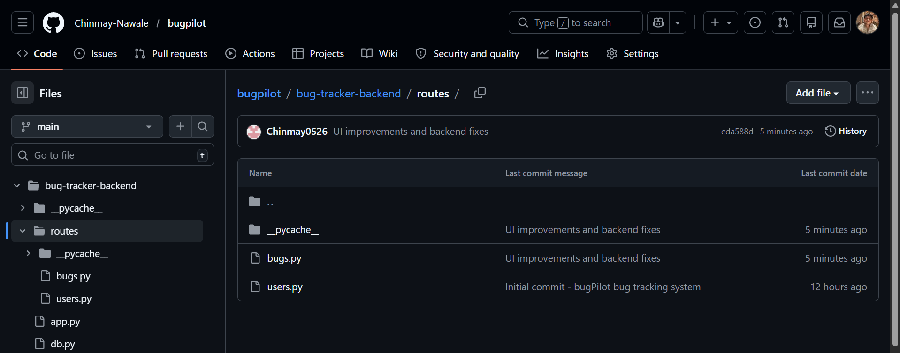
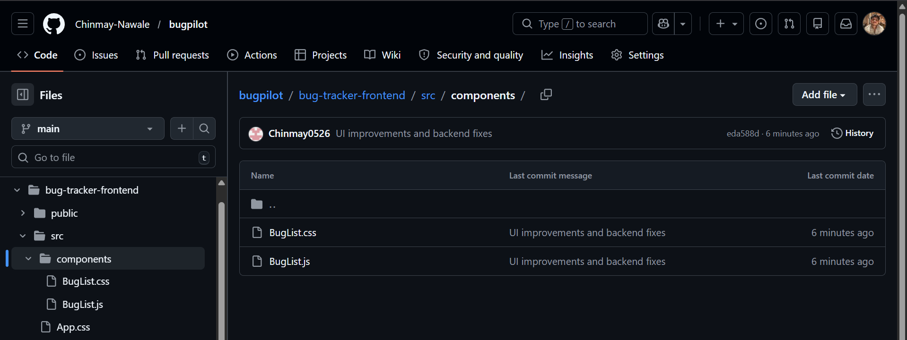

# BugPilot

BugPilot is a full-stack bug tracking system built using React, Flask, and MySQL.  
It allows users to create, manage, and track bugs efficiently.

## Features

- Create new bugs
- Update bug status (Open → In Progress → Closed)
- Delete bugs
- Search bugs
- Filter bugs by status
- Sort bugs by priority and date
- Dashboard statistics
- Bug detail modal popup

## Tech Stack

Frontend:
- React
- Axios
- CSS

Backend:
- Flask (Python)

Database:
- MySQL

Tools:
- Git
- GitHub

## Screenshots

### Dashboard

### Bug List

### Create Bug

### Bug Details Popup

### Backend Structure

### Frontend Structure

